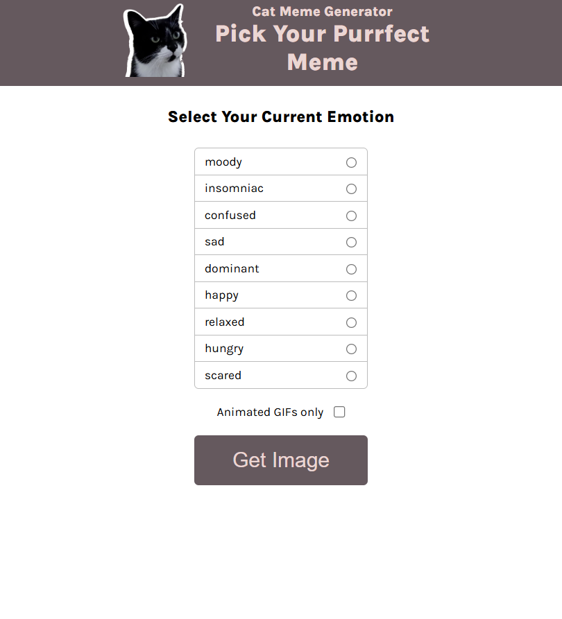
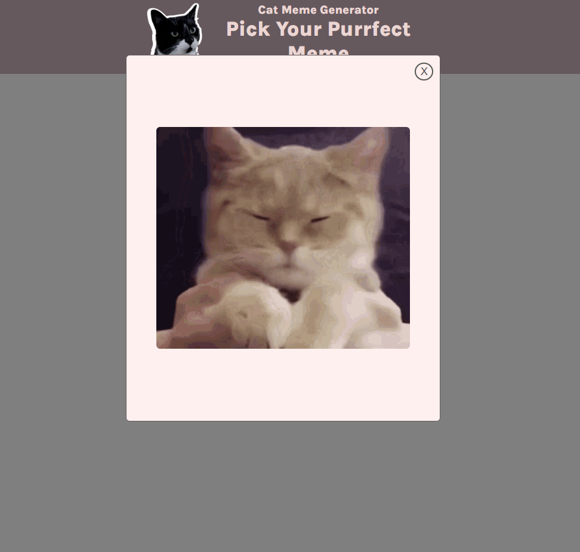

# Cat Meme Generator

This project is a fun web application that allows you to create hilarious cat memes!  You can choose from a variety of cat images, add custom text, and download your meme to share with friends.

**Motivation:** This project was built as part of the Scrimba Frontend Developer Career Path, to practice and demonstrate skills learned throughout the course.

**Live Deployment:** [https://gilded-yeot-66ed95.netlify.app/](https://gilded-yeot-66ed95.netlify.app/)

## Screenshots


*The main interface of the Cat Meme Generator, showing the image selection area.*


*An example of a meme being created,*

## Features

*   **Cat Image Selection:** Browse through a collection of adorable (and sometimes grumpy) cat images.
*   **Custom Text Input:** Add your own captions and text overlays.
*   **Meme Customization:** Adjust font size, color, and position of the text.
*   **Meme Download:** Save your meme as an image file.
*   **User-friendly Interface:** Easy to use controls and a simple interface.

## Getting Started

These instructions will help you set up and run the Cat Meme Generator project on your local machine.

### Prerequisites

*   **Node.js:**  Make sure you have Node.js installed. You can download it from [https://nodejs.org/](https://nodejs.org/).  Node.js also includes npm.
*   **npm (Node Package Manager):**  Comes bundled with Node.js.

### Installation

1.  **Clone the repository:**
    ```bash
    git clone <repository_url>
    ```
    *Replace `<repository_url>` with the actual URL of your project's Git repository.*

2.  **Navigate to the project directory:**
    ```bash
    cd Cat-meme-generator
    ```
    *Replace "Cat-meme-generator" if the folder is named differently.*

3.  **Install dependencies:**
    ```bash
    npm install
    ```
    This command will install all the necessary packages listed in the `package.json` file.

### Running the Project

1.  **Start the development server:**
    ```bash
    npm start
    ```
    This command will start a local development server. The application will typically be accessible in your web browser at `http://localhost:5173/` or a similar address.

### Building for Production

1.  **Build process**
    ```bash
    npm run build
    ```
    This will build the project to a /dist folder.

2.  **Serving the production build**
    ```bash
    npm run preview
    ```
    This will start a server with the production files.

## Technologies Used

*   [Vite](https://vitejs.dev/):  A fast build tool and development server.
*   React (This is most likely used since it is a Scrimba path)
*   other libraries if present

## Contributing

If you'd like to contribute to the project, feel free to fork the repository and submit a pull request! If you have any ideas or suggestions, please open an issue.

## License

[MIT](https://opensource.org/license/mit/)
(Or another license, if applicable)
